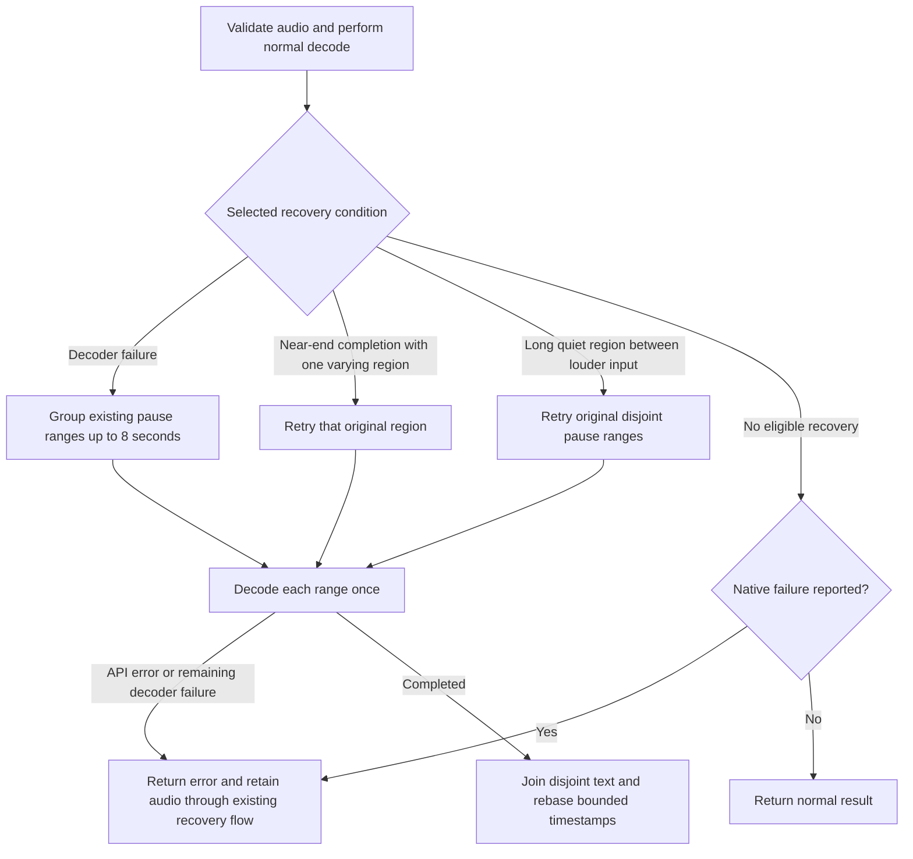

# Local speech recovery

VOCO keeps the existing base.en model and normal decoding parameters. A bounded
recovery pass addresses decoder failures and two acoustic boundary conditions.
Full-session, canonical-chunk and preview transcription share the same controller
in `apps/desktop/src-tauri/src/transcribe.rs`.

The order is deliberate. A selected decoder-failure recovery takes priority over
the boundary conditions. Retry calls invoke the single-decode function directly;
they cannot recursively schedule more recovery.

## Capture completion and explicit retry

The AudioWorklet's `flushed` acknowledgment confirms delivery of its queued sample
messages. The existing 80 ms shutdown deadline is a failure boundary, not an
acknowledgment: timeout, a rejected port message or graph disposal cannot authorize
automatic transcription of an apparently complete capture. The graph and tracks
are released even if flushing fails.

If AudioWorklet initialization fails, ScriptProcessor capture retains received
audio for manual recovery only. Its callback API has no input-tail acknowledgment;
waiting for another callback cannot prove completeness under main-thread stalls.
Live previews and automatic checkpoints are disabled before connecting this
fallback, and a visible notice explains that the recording requires review. Stop
reports the same typed incomplete-capture error, closes the graph, and retains
received samples for Retry or Discard. Retry stays in VOCO for explicit copying.
This compatibility path cannot recover samples the browser never delivered.

On an unconfirmed flush, the frontend retains the samples already received and
any completed canonical prefix, invalidates pending automatic output, and shows a
persistent capture notice. Retrying can transcribe received audio; it cannot
reconstruct a potentially missing tail. That notice therefore survives a
successful manual retry until the recovery is discarded or a new recording starts.
These guarantees concern received transport messages, not physical microphone fidelity.

Retry first waits for earlier native transcription and delivery operations to
settle. That wait has its own identity token and a visible Cancel action. Cancelling
the wait returns immediately to retained recovery; it does not interrupt native
decoding. Later completion checks the token before starting another request.
Discard, unmount and replacement sessions invalidate stale work, including shared
checkpoint-deferred state. A successful retry stays in VOCO for explicit copying.

## Native diagnostics and rejection

The pinned, owned native source exposes four observations, reset on every full
call, including an early return:

- Low-confidence rejection: a loop or entropy rejection followed by a final
  selected sequence below the existing average log-probability threshold.
- Terminal decoder failure: a final selected decoder remains marked failed after
  the native fallback schedule.
- Repetition rejection history: at least one decoder attempt in the native temperature
  schedule rejected a repetition. This remains visible even if a later attempt completes.
- Near-end completion: a selected decoder stopped solely at the original near-end
  margin, with its earliest absolute offset in native 10 ms frames.

Low-confidence and terminal failures take precedence over repetition-history recovery.
History can select the same bounded recovery even when the final attempt reached its end.
It does not change native thresholds, temperature schedules or model weights.

These signals are independent of transcript spelling and reference text. A native
timestamp is not proof that all spoken words were recognized. A successful API
return can still carry a terminal failure signal. A failed retry, or a native
failure with no eligible recovery partition, therefore returns an error before
publishing its partial result. An empty failed output follows the same error path;
an unflagged empty result remains successful. Previously completed retry-window
timing bounds remain in diagnostic state; transcript text is not retained there.
The existing frontend error path retains
the original recording in memory for retry or discard. Canonical recovery retains
its completed prefix and retries the failed tail without committing text to a new
field. An unavailable automatic retry does not start an unbounded retry loop.

The original native no-speech guard remains active. An additive guard uses the
same existing confidence thresholds on accepted lexical tokens to suppress a
measured faint-noise hallucination. Neither guard is a general speech detector.

## Acoustic windows

Pause detection measures mean-square power over 20 ms frames. At least 200 ms
below 1% of peak frame power can propose a boundary. Short pauses are split at
their center; pauses longer than one second retain 250 ms at each neighboring
edge. Every disjoint range retains at least 1.5 seconds, and all original samples
remain represented. No gain adjustment, model replacement or lexical correction
is applied.

Decoder-failure recovery merges adjacent existing ranges up to eight seconds,
without making new cuts. These short retries use an encoder context of 512 frames;
longer ranges retain the native default. Full default context and beam-search
alternatives introduced measured omissions and were rejected. Normal decoding,
tail recovery and mixed-level recovery retain the native default context.

Tail recovery requires a valid near-end offset with residual variation and exactly
one varying pause region; all other regions must satisfy the existing numerical
silence/DC check. Mixed-level recovery requires a nonedge varying region at least
eight seconds long, every frame below the existing relative power threshold, and
higher-power input on both sides. It retries the original uncoalesced ranges.
Noise can satisfy this condition too: it routes acoustic analysis and does not
declare that the middle contains speech.

Only retry timestamps are rebased and clamped to their original sample ranges,
with monotonic segment bounds. Normal preview timestamps retain their existing
contract. Disjoint retry text is joined without removing repeated words. Existing
long-session overlap and canonical committed-prefix rules remain separate. The current
full-session and VCA2 paths share the [hybrid planner and receipt executor](hybrid-recognition.md).
The legacy VCA1 canonical API and provisional preview path remain compatible.

## Evidence and limits

The replay example uses the real application library and attaches per-request
decode decisions to its JSON response. It records routing, sample ranges, native
failure counts and completed-window timing bounds. Persistent diagnostics contain
no transcript strings or audio samples. It does not enable telemetry or
change the user-facing IPC response.

See [speech evaluation](../testing/speech-adversarial-evaluation.md) for frozen
references, independent per-case failure gates and noise controls. Passing helper
tests, observing nonempty text or preserving phrase counts does not establish
word accuracy. In the historical iteration 5 candidate, four additional repetition cases exceeded the fixed word-error
bound in development evidence. That candidate's final qualification also failed two versions of a
previously unseen name-containing phrase. Those retained runs remain failed;
passing family averages never override per-case failures. The historical long
continuity fixture retains four inserted words from an unchanged second window,
now exposed by recovering speech in the first window. See the
[iteration 5 record](../testing/foundations-iteration-5-2026-09-05.md) for those
scores and artifact identity. Its stronger continuity gate fails the extra phrase,
and two of 20 new qualification cases fail supplemental word integrity despite
meeting WER limits. Physical microphones and installed desktop combinations
require their own qualification. The subsequent history/planner/spacing candidate passed
its separately recorded 28-case accuracy, 89-file regression and warm-performance gates.
Those cases are consumed evidence; inherited word errors remain. The application integration
still requires production-API parity and platform qualification before release.

The owned crates, original archives, minimal patches, exact source inventory and
license notices live in `vendor/`. Source verification runs before packaging and
the speech gate. It proves which code is built; it does not prove recognition
accuracy or cross-machine binary compatibility.
