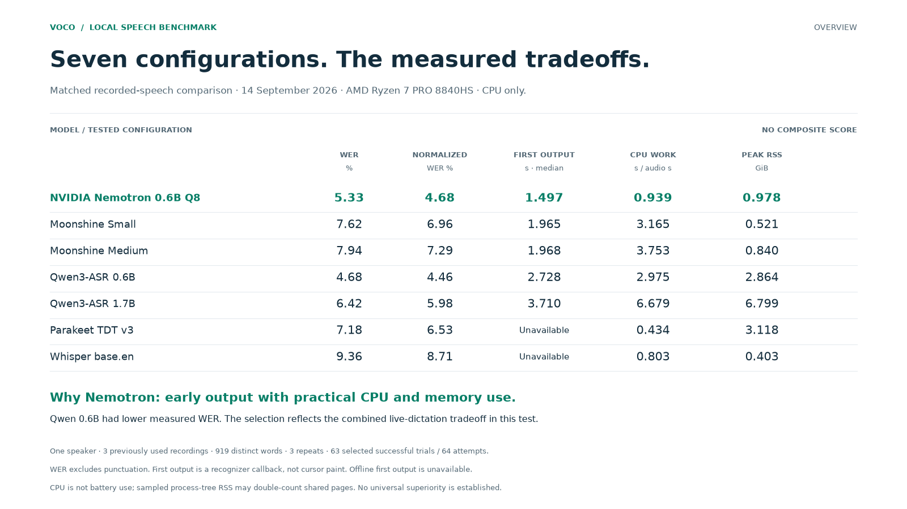

# VOCO benchmark gallery

**All seven tested configurations, one metric at a time.** These release assets explain the recorded evidence behind VOCO's NVIDIA Nemotron default. The main study compared the same three recordings across seven local model/runtime configurations. Earlier public-speech and application tests are presented separately.

This collection accompanies **VOCO 2026.0.43** and was prepared on **20 September 2026**. The model measurements are historical results from **14 September 2026**, not new tests of the .43 executable.

[Full methods](model-comparison/README.md) · [Exact values (CSV)](model-comparison/data/metric-values.csv) · [PDF collection](model-comparison/VOCO-all-models-benchmark.pdf) · [8K PNG files](model-comparison/png) · [Scalable SVG files](model-comparison/svg)

Every image is available as a **7680 × 4320 PNG** and a resolution-independent SVG. The images embedded below are lightweight previews. Select the **8K PNG** or **SVG** link beneath a figure for its full-quality file.

## Reading these results

- The matched study used one speaker, three previously used recordings, 919 distinct reference words, and three repeats per configuration: **63 selected successful trials from 64 attempts**. Repeats do not add independent speakers.
- Inference ran **on an AMD Ryzen 7 PRO 8840HS CPU**, without NVIDIA GPU acceleration. Runtime thread settings and supported delivery modes differ.
- Green identifies VOCO's selected default, **not the winner of every metric**. Qwen 0.6B had lower measured WER; Nemotron offered the selected balance of response, resource use and accuracy. No composite score or universal ranking is implied.
- Missing measurements and unsuccessful prototype trials remain labeled. Recognizer callbacks, completion tails and app Stop-to-idle are different clocks. No punctuation-accuracy, all-model TypeSafe or pixel-paint scores are invented.
- Keep each image's footnotes when sharing. Personal recordings, transcripts, credentials and raw API responses are not included.

## Figures

### 00 · Seven configurations. The measured tradeoffs.

[8K PNG](model-comparison/png/00-overview.png) · [SVG](model-comparison/svg/00-overview.svg)

All seven configurations, same one-speaker corpus. WER, normalized WER, first callback, CPU work and sampled memory. No composite grade.

### 01 · Word error rate

[8K PNG](model-comparison/png/01-word-error-rate.png) · [SVG](model-comparison/svg/01-word-error-rate.svg)

Same recordings. Same references. All seven tested configurations. Ignores punctuation and case; number rendering still affects errors. 919 distinct reference positions, replayed three times: 2,757 word observations per model. One speaker · 3 previously used recordings · 919 distinct reference words · 63 selected successes / 64 attempts. 14 Sep 2026 · AMD Ryzen 7 PRO 8840HS · CPU only · runtime thread settings differ · no general model ranking.

### 02 · Contraction-normalized word error rate

[8K PNG](model-comparison/png/02-normalized-word-error-rate.png) · [SVG](model-comparison/svg/02-normalized-word-error-rate.svg)

Same recordings. Same references. All seven tested configurations. Also expands contractions; this is a separate sensitivity score, not semantic accuracy. 919 distinct reference positions, replayed three times: 2,757 word observations per model. One speaker · 3 previously used recordings · 919 distinct reference words · 63 selected successes / 64 attempts. 14 Sep 2026 · AMD Ryzen 7 PRO 8840HS · CPU only · runtime thread settings differ · no general model ranking.

### 03 · First recognizer output

[8K PNG](model-comparison/png/03-first-output.png) · [SVG](model-comparison/svg/03-first-output.svg)

Median from audio sample zero · nine trials per streaming configuration. Recognizer callback timing, not first correct word, cursor appearance or pixel paint. Parakeet and Whisper used offline adapters in this comparison. One speaker · 3 previously used recordings · 919 distinct reference words · 63 selected successes / 64 attempts. 14 Sep 2026 · AMD Ryzen 7 PRO 8840HS · CPU only · runtime thread settings differ · no general model ranking.

### 04 · CPU work per second of audio

[8K PNG](model-comparison/png/04-cpu-work.png) · [SVG](model-comparison/svg/04-cpu-work.svg)

Median across nine trials · lower values mean less measured CPU work. Total CPU work across threads, including replay controller; excludes model load and warmup. CPU-only execution; runtimes use different thread settings. This is not battery consumption. One speaker · 3 previously used recordings · 919 distinct reference words · 63 selected successes / 64 attempts. 14 Sep 2026 · AMD Ryzen 7 PRO 8840HS · CPU only · runtime thread settings differ · no general model ranking.

### 05 · Peak sampled resident memory

[8K PNG](model-comparison/png/05-memory.png) · [SVG](model-comparison/svg/05-memory.svg)

Maximum across nine trials · process-tree RSS, including startup. Sampled process-tree sum includes model load and warmup; shared pages may count more than once. Samples can miss short-lived peaks. This is not whole-system memory use. One speaker · 3 previously used recordings · 919 distinct reference words · 63 selected successes / 64 attempts. 14 Sep 2026 · AMD Ryzen 7 PRO 8840HS · CPU only · runtime thread settings differ · no general model ranking.

### 06 · Work remaining after speech ends

[8K PNG](model-comparison/png/06-completion-tail.png) · [SVG](model-comparison/svg/06-completion-tail.svg)

Same 303.712-second recording · median of three streaming trials. Completion minus scheduled audio end; queued work remains visible. This is not app Stop-to-idle. Logarithmic seconds axis; labels use ms below one second. Each equal axis step represents a 10× change. Long-recording slice · one speaker · 303.712 s · 3 repeats per model · drawn from the 63/64-trial comparison. 14 Sep 2026 · AMD Ryzen 7 PRO 8840HS · CPU only · runtime thread settings differ · no general model ranking.

### 07 · Text available when audio ends

[8K PNG](model-comparison/png/07-progress-at-audio-end.png) · [SVG](model-comparison/svg/07-progress-at-audio-end.svg)

Same 303.712-second recording · median of three streaming trials. Hypothesis word count / final hypothesis word count. Provisional words may be revised. This measures output progress, not word accuracy or text committed to another application. Long-recording slice · one speaker · 303.712 s · 3 repeats per model · drawn from the 63/64-trial comparison. 14 Sep 2026 · AMD Ryzen 7 PRO 8840HS · CPU only · runtime thread settings differ · no general model ranking.

### 08 · Completed-prefix revisions

[8K PNG](model-comparison/png/08-prefix-revisions.png) · [SVG](model-comparison/svg/08-prefix-revisions.svg)

Same 303.712-second recording · median count across three streaming trials. Counts changes to earlier completed hypothesis words; unfinished-word extensions are excluded. Revisions can be useful corrections. A zero count does not prove that the recognized text is correct. Long-recording slice · one speaker · 303.712 s · 3 repeats per model · drawn from the 63/64-trial comparison. 14 Sep 2026 · AMD Ryzen 7 PRO 8840HS · CPU only · runtime thread settings differ · no general model ranking.

### 09 · Longest observed text-update gap

[8K PNG](model-comparison/png/09-update-gap.png) · [SVG](model-comparison/svg/09-update-gap.svg)

Same 303.712-second recording · maximum across three streaming trials. Intervals between recognizer text changes can include legitimate silence and punctuation updates. This is not voiced-speech lag or a percentile estimate. No acoustic word-end alignment was available. Long-recording slice · one speaker · 303.712 s · 3 repeats per model · drawn from the 63/64-trial comparison. 14 Sep 2026 · AMD Ryzen 7 PRO 8840HS · CPU only · runtime thread settings differ · no general model ranking.

### 10 · Model loading time

[8K PNG](model-comparison/png/10-model-load.png) · [SVG](model-comparison/svg/10-model-load.svg)

Median across nine process launches · retained filesystem cache conditions. Adapter-reported loading boundary; runtime initialization is not identical across implementations. OS caches were uncontrolled. This is not cold-boot startup or shortcut-to-ready latency. One speaker · 3 previously used recordings · 919 distinct reference words · 63 selected successes / 64 attempts. 14 Sep 2026 · AMD Ryzen 7 PRO 8840HS · CPU only · runtime thread settings differ · no general model ranking.

### 11 · Warmup decoding time

[8K PNG](model-comparison/png/11-warmup.png) · [SVG](model-comparison/svg/11-warmup.svg)

Median across nine trials · same separate 2.09-second public warmup. Adapter-reported warmup; separate from model load and the measured comparison recordings. These runtime boundaries do not establish end-to-end application readiness. One speaker · 3 previously used recordings · 919 distinct reference words · 63 selected successes / 64 attempts. 14 Sep 2026 · AMD Ryzen 7 PRO 8840HS · CPU only · runtime thread settings differ · no general model ranking.

### 12 · Full-recording offline decoding

[8K PNG](model-comparison/png/12-offline-decode.png) · [SVG](model-comparison/svg/12-offline-decode.svg)

Same 303.712-second recording · median of three offline trials. Entire recording decoded offline by the tested Parakeet and Whisper adapters. Streaming completion tails are a different metric and are not inserted into this comparison. Long-recording slice · one speaker · 303.712 s · 3 repeats per model · drawn from the 63/64-trial comparison. 14 Sep 2026 · AMD Ryzen 7 PRO 8840HS · CPU only · runtime thread settings differ · no general model ranking.

### 13 · Earlier public-speech accuracy

[8K PNG](model-comparison/png/13-earlier-public-speech.png) · [SVG](model-comparison/svg/13-earlier-public-speech.svg)

Separate cohort · 40 public speakers · 998 reference words · four integrations. Do not combine these rates with the one-speaker recorded-speech comparison. WER excludes punctuation. Previously evaluated corpus; the NVIDIA–Moonshine Medium accuracy difference is not conclusive. 14 Sep 2026 · 160 completed inferences · CPU only · NVIDIA 13, Small 27, Medium 19, Whisper 23 word errors. Historical regression corpus; NVIDIA vs Medium descriptive 95% WER-difference interval: −0.11 to +1.41 pp.

### 14 · Earlier application Stop-to-idle

![Separate application test · isolated X11 / GTK · one 47-word public clip. NVIDIA / VOCO .34 and Whisper / .33: three completed trials each. Different complete app integrations. Moonshine: one unsuccessful prototype trial per model; no successful Stop time. Not release .43 timings. 14 Sep 2026 · 6 completed trials + 2 failed feasibility trials · CPU only · field/state observation, not pixel paint. Observed Stop ranges: NVIDIA 161–165 ms; Whisper 2,579–3,066 ms. Small sample; no percentile guarantee.](model-comparison/previews/14-earlier-app-stop.png)

[8K PNG](model-comparison/png/14-earlier-app-stop.png) · [SVG](model-comparison/svg/14-earlier-app-stop.svg)

Separate application test · isolated X11 / GTK · one 47-word public clip. NVIDIA / VOCO .34 and Whisper / .33: three completed trials each. Different complete app integrations. Moonshine: one unsuccessful prototype trial per model; no successful Stop time. Not release .43 timings. 14 Sep 2026 · 6 completed trials + 2 failed feasibility trials · CPU only · field/state observation, not pixel paint. Observed Stop ranges: NVIDIA 161–165 ms; Whisper 2,579–3,066 ms. Small sample; no percentile guarantee.

## Evidence and reuse

[Detailed methodology](model-comparison/BACKGROUND.md) explains the decisions, unsuccessful attempts and remaining limits. [Source hashes](model-comparison/data/source-hashes.json), [numeric verification](model-comparison/VERIFICATION.json), and [file checksums](model-comparison/SHA256SUMS) make this collection auditable. Source paths identify retained local evidence; private source recordings are not distributed.

The [renderer](model-comparison/tools/render.py) and [verifier](model-comparison/tools/verify.py) use the included numeric data. [Reproduction instructions](model-comparison/README.md#audit-and-reproducibility) describe their dependencies. These assets describe measured configurations and do not imply model-vendor endorsement.

For current installation coverage, see the [Linux support matrix](../../linux-support.md). Download software from [GitHub Releases](https://github.com/sergiopesch/voco/releases/latest).
