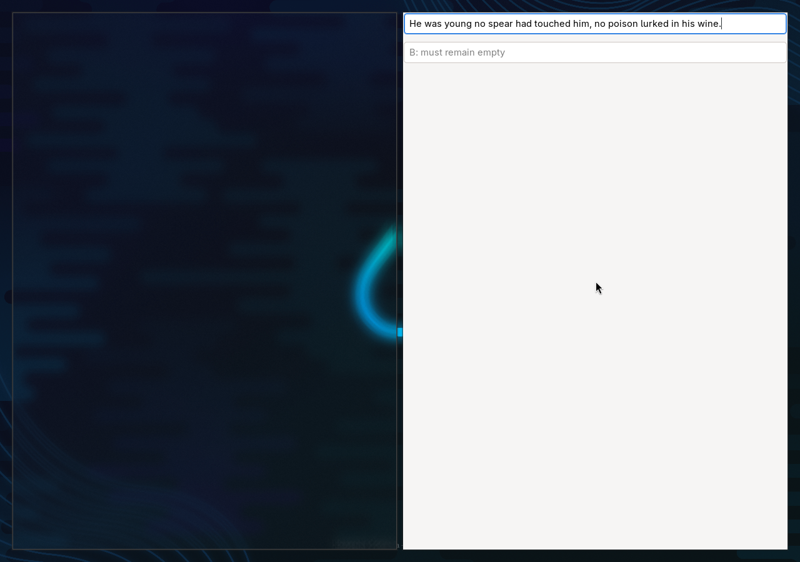

# Omarchy native package and Hyprland qualification

**Status: experimental; not ready for general Omarchy distribution.**

The public 2026.0.42 application/model payload was packaged with native Arch
metadata and tested on 2026-09-19. No application bytes or speech settings changed.
The Debian release and installed reference application remain unchanged.

## Findings that block support

- A normal user in the prepared guest could not read keyboard devices. VOCO selected
  its evdev backend but found no accessible keyboard. The successful tests granted
  read access only to two emulated guest keyboards and explicitly provisioned
  ydotoold with a user-owned socket. This is a diagnostic configuration, not an
  automatic permission policy for end users. A compositor-native shortcut route
  and a documented, narrowly scoped input-helper setup need qualification.
- After **Hide and try dictation**, the VOCO surface remained mapped as a blank
  tile beside the recipient. The existing hidden-window implementation resizes
  and positions the surface off-screen rather than unmapping it. This approach
  did not hide it in the tested tiling compositor. Any fix must preserve capture
  continuity; simply hiding WebKit needs its own audio/lifecycle regression tests.
- SentencePiece is supplied by a separately vetted local support package, not an
  official Arch dependency in this evidence. Native release signing, dependency
  delivery and the standard Omarchy installation flow remain unqualified.

## Evidence

The [machine-readable summary](evidence/omarchy-2026-09-19/summary.json) records
package identity, measurements and scope.

| Check | Outcome |
| --- | --- |
| Staging boundary regressions | 12 passed |
| Native build | `makepkg` produced Arch packages from the verified Debian payload |
| Signature enforcement | Unsigned candidate rejected; disposable test-signed candidate accepted without weakening pacman policy |
| Install, upgrade, reinstall | 218 payload entries and 9 ELF objects verified at each recorded parity check |
| Removal | All 169 payload files/links absent; user configuration preserved |
| Package revision upgrade | 1 → 2; final staging changes additionally built and verified revision 3 |
| Native package X11 smoke | Fresh onboarding and 14-word fixture delivered correctly |
| Booted Hyprland delivery | Fresh onboarding, native Wayland GTK field, 14/14 words correct; other field unchanged |
| Repeated dictation | Two successive sessions appended 28/28 words correctly |
| Focus departure | Further delivery stopped; other field stayed empty; recovery retained |
| Speech-session Stop → idle | 246 ms for initial delivery; 240/242 ms for repeated sessions |
| Playback launch → first field mutation | 1,066.8 ms initial delivery; 1,064.6 ms first repeated session |

These are individual observations, not percentile estimates or physical-machine
benchmarks. Field mutation is not pixel paint or spoken-word-end latency. The
focus-departure case deliberately does not finish transcription into the field;
it is excluded from accuracy and successful Stop-to-idle results.

## Environment and boundaries

- Crabbox local-container lease: `cbx_bc97498470fe`, 4 CPUs and 6 GiB RAM.
- Genuine Omarchy 4.0.3 ISO-derived userspace, updated with signed Arch packages.
- A separate QEMU/KVM guest booted that prepared filesystem: Linux 7.2.6,
  Hyprland 0.56.2, 4 virtual CPUs, 4 GiB RAM, software-rendered virtual graphics.
- Minimal Hyprland configuration, no Omarchy default shell/theme/configuration
  qualification. This was not an install through the Omarchy installer.
- A fresh profile per app trial; public licensed fixture `251-118436-0000.wav`;
  private virtual audio; emulated keyboard Start/Stop; native app clipboard delivery.
- The successful field and application windows were both reported as native
  Wayland (`xwayland: false`) by the compositor. Field text was observed through GTK.
- The VM had its own kernel and input devices. No owner desktop, physical input,
  microphone, display or audio socket was connected to the tests.
- Package signatures used a disposable test key trusted only in the guest/container.
  The native artifacts are not public releases signed with the VOCO release key.

Earlier failures are retained: missing build tool, required signature rejection,
nested Weston protocol incompatibility, a nested Cage allocator/protocol failure,
and test-driver setup errors involving IBus, runtime-directory validation, a stale
PulseAudio process, current Hyprland dispatch syntax and intentionally ignored
synthetic keys. Those attempts are not counted as successful app trials. An early
VM boot raced filesystem creation and could not mount the disk; it was stopped,
creation completed, and a read-only filesystem check passed before the real boot.

VOCO intentionally ignores ydotool-generated keyboard events to avoid feedback.
Start/Stop validation therefore uses QEMU's emulated keyboard; ydotool is used only
by normal application delivery. The evidence does not establish global shortcut
support in an unconfigured Omarchy account.

## Remaining acceptance work

1. Qualify shortcut activation and text delivery with a normal user and a narrowly
   defined permission policy; do not silently add users to the input group.
2. Correct hidden/tray window behavior on Hyprland and verify capture remains live.
3. Test the actual Omarchy installer/default desktop, existing dictation bindings,
   native browsers, Electron editors and terminal/Neovim behavior.
4. Run long sessions, device loss, suspend/resume and physical microphone checks.
5. Publish native packages only after production signing, dependency provenance,
   clean installation and the remaining desktop checks pass.
